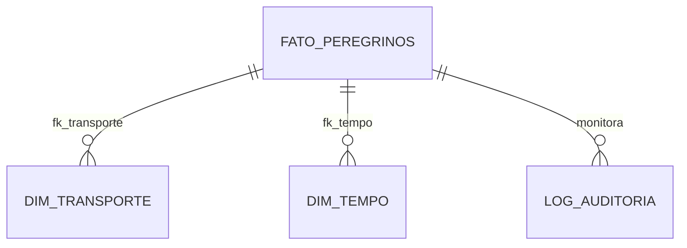
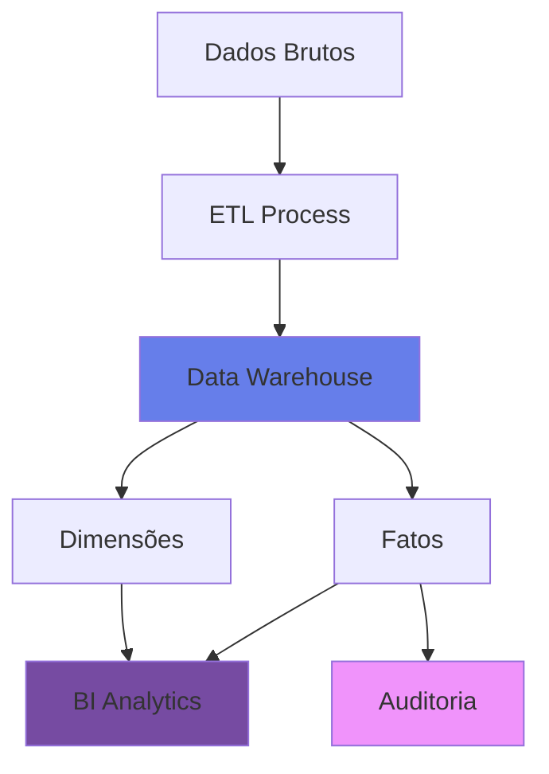

<div align="center">
  
  
  # 🌍 Tour4Friends Analytics - Data Warehouse
  
  
  
  <br/>
  
  **Projeto Integrador - 3º Semestre** | **Curso:** Big Data para Negócios | **Instituição:** FATEC
  
  <br/>
  
  
  
  
  
  
</div>

---

## 📋 Sobre o Projeto

<table>
<tr>
<td width="70%" valign="top">

Este repositório contém a implementação do **Data Warehouse (DW)** para a empresa fictícia **Tour4Friends**. O objetivo do projeto é estruturar dados de peregrinação e turismo para permitir análises estratégicas sobre fluxo de pessoas, modalidades de transporte e sazonalidade.

O foco deste entregável é a implementação de **Lógica de Negócio no Banco de Dados (PL/pgSQL)**, garantindo automação, consistência e auditoria dos dados diretamente na camada de armazenamento.

### 🎯 Objetivos do Projeto
- ✅ Implementar Data Warehouse com modelagem dimensional
- ✅ Criar rotinas avançadas de automação em PL/pgSQL
- ✅ Garantir governança e auditoria de dados
- ✅ Facilitar análises estratégicas de Business Intelligence

</td>
<td width="30%" valign="top" align="center">

<br/>

```sql
-- Data-Driven
SELECT decision
FROM analytics
WHERE quality = 'HIGH'
  AND automation = TRUE
  AND governance = TRUE;
```

<br/>

**🏗️ Arquitetura**

Star Schema ⭐

**🔐 Segurança**

Auditoria Completa

**⚡ Performance**

Queries Otimizadas

</td>
</tr>
</table>

---

<details open>
  <summary><h2>👥 Integrantes do Grupo</h2></summary>
  
  <br/>
  
  <table align="center">
    <tr>
      <td align="center">
        <a href="#">
          <br/>
          <sub><b>Pablo Roberto</b></sub>
        </a>
      </td>
      <td align="center">
        <a href="#">
          <br/>
          <sub><b>Lucas Antonio</b></sub>
        </a>
      </td>
      <td align="center">
        <a href="#">
          <br/>
          <sub><b>Thiago Cardoso</b></sub>
        </a>
      </td>
      <td align="center">
        <a href="#">
          <br/>
          <sub><b>William Nunes</b></sub>
        </a>
      </td>
      <td align="center">
        <a href="#">
          <br/>
          <sub><b>Murilo Santos</b></sub>
        </a>
      </td>
      <td align="center">
        <a href="#">
          <br/>
          <sub><b>Daniel Fernando</b></sub>
        </a>
      </td>
      </tr>
    
  </table>
  
</details>

---

## 🛠️ Tecnologias Utilizadas

<div align="center">

<table>
  <tr>
    <td align="center" width="96">
      
      <br>PostgreSQL 16
    </td>
    <td align="center" width="96">
      
      <br>VS Code
    </td>
    <td align="center" width="96">
      
      <br>Git/GitHub
    </td>
    <td align="center" width="96">
      
      <br>GitHub
    </td>
  </tr>
</table>

### 📚 Stack Técnica

| Categoria | Tecnologia |
|-----------|-----------|
| **Banco de Dados** | PostgreSQL 16 |
| **Linguagem** | SQL (PL/pgSQL) |
| **Modelagem** | Star Schema (Fatos e Dimensões) |
| **Versionamento** | Git/GitHub |
| **IDE** | VS Code |

</div>

---

## 🚀 Funcionalidades Implementadas

<div align="center">
  <h3>Entregável de Banco de Dados - Lógica de Negócio Avançada</h3>
</div>

Conforme os requisitos do projeto integrador, foram desenvolvidas rotinas avançadas de banco de dados para suportar a inteligência de negócios.

### 1️⃣ Stored Procedure com Cursor Dinâmico

<table>
<tr>
<td width="50%" valign="top">

#### 📌 Informações Técnicas

**Nome:** `calcular_total_peregrinos_dinamico`

**Tipo:** Stored Procedure com Cursor Não Vinculado (Unbound)

**Parâmetros:**
- Tabela de origem
- Campo de agrupamento
- Campo de soma

</td>
<td width="50%" valign="top">

#### 💡 Aplicação no Negócio

Permite aos analistas de dados gerar relatórios rápidos sobre quais modais (Bicicleta, A pé, etc.) estão sendo mais utilizados, facilitando o direcionamento de investimentos em infraestrutura.

**Benefícios:**
- ⚡ Queries dinâmicas em tempo de execução
- 📊 Flexibilidade analítica
- 🎯 Decisões data-driven

</td>
</tr>
</table>

#### 🔧 Funcionalidade

Percorre a tabela de fatos utilizando um *cursor não vinculado (unbound)* e executa uma query dinâmica. Permite calcular a soma total de peregrinos agrupada por qualquer dimensão escolhida em tempo de execução (ex: agrupar por Tipo de Transporte ou por Mês), sem necessidade de reescrever o código SQL.

---

### 2️⃣ Trigger de Auditoria (Log de Segurança)

<table>
<tr>
<td width="50%" valign="top">

#### 📌 Informações Técnicas

**Nome:** `trg_vigia_peregrinos`

**Tabela Monitorada:** `fato_peregrinos_por_transporte`

**Eventos Capturados:**
- 🔵 `INSERT`
- 🟡 `UPDATE`
- 🔴 `DELETE`

</td>
<td width="50%" valign="top">

#### 💡 Aplicação no Negócio

Garante a **Governança de Dados**. Evita que números históricos de peregrinos sejam alterados acidentalmente ou maliciosamente sem deixar rastros, assegurando a confiabilidade dos dashboards gerenciais.

**Benefícios:**
- 🛡️ Rastreabilidade completa
- 📝 Logs automáticos
- ✅ Compliance garantido

</td>
</tr>
</table>

#### 🔧 Funcionalidade

Monitora eventos de `INSERT`, `UPDATE` e `DELETE` na tabela principal de fatos. Sempre que um dado financeiro ou de contagem é alterado, o trigger dispara automaticamente e grava uma cópia dos dados originais e dos novos dados em uma tabela de histórico (`Log_Auditoria_Peregrinos`), junto com o usuário e data da alteração.

---

## 📂 Estrutura do Banco de Dados

<div align="center">

### ⭐ Modelagem Star Schema

<table align="center">
  <tr>
    <th>Tipo</th>
    <th>Nome da Tabela</th>
    <th>Descrição</th>
  </tr>
  <tr>
    <td align="center">🎯 <b>Fato</b></td>
    <td><code>fato_peregrinos_por_transporte</code></td>
    <td>Registra a quantidade de peregrinos</td>
  </tr>
  <tr>
    <td align="center">📊 <b>Dimensão</b></td>
    <td><code>dim_transporte</code></td>
    <td>Modalidades: A pé, Bicicleta, Cavalo, etc.</td>
  </tr>
  <tr>
    <td align="center">📊 <b>Dimensão</b></td>
    <td><code>dim_tempo</code></td>
    <td>Sazonalidade: Ano, Mês, Estação</td>
  </tr>
  <tr>
    <td align="center">🔐 <b>Auxiliar</b></td>
    <td><code>log_auditoria_peregrinos</code></td>
    <td>Tabela criada automaticamente para logs</td>
  </tr>
</table>

</div>



---

## ▶️ Como Executar

<details>
  <summary><h3>📥 Passo 1: Clonar o Repositório</h3></summary>
  
  ```bash
  git clone https://github.com/Thiago-code-lab/tour4friends-analytics.git
  cd tour4friends-analytics
  ```
  
</details>

<details>
  <summary><h3>🔌 Passo 2: Conectar ao Banco de Dados</h3></summary>
  
  Utilize o **VS Code** ou **PgAdmin** para conectar ao seu servidor PostgreSQL local.
  
  **Configuração Recomendada:**
  - Host: `localhost`
  - Porta: `5432`
  - Database: `tour4friends_dw`
  - User: `postgres`
  
</details>

<details>
  <summary><h3>🏗️ Passo 3: Criar a Estrutura</h3></summary>
  
  Execute o script `table.sql` para criar as tabelas e relacionamentos.
  
  ```sql
  \i table.sql
  ```
  
</details>

<details>
  <summary><h3>⚙️ Passo 4: Criar a Lógica</h3></summary>
  
  Execute o script `database_objects.sql` para criar a Procedure e o Trigger.
  
  ```sql
  \i database_objects.sql
  ```
  
</details>

<details open>
  <summary><h3>✅ Passo 5: Testar</h3></summary>
  
  Execute o comando para testar a stored procedure:
  
  ```sql
  CALL calcular_total_peregrinos_dinamico(
    'fato_peregrinos_por_transporte', 
    'fk_transporte', 
    'qtd_peregrinos'
  );
  ```
  
  **Saída Esperada:**
  ```
  ✓ Query executada com sucesso
  ✓ Totais calculados por modalidade de transporte
  ✓ Resultados agrupados e ordenados
  ```
  
</details>

---

## 📊 Arquitetura do Projeto



---

## 📈 Benefícios da Implementação

<div align="center">

| 🎯 Aspecto | 📊 Benefício |
|-----------|-------------|
| **Performance** | Consultas otimizadas com índices estratégicos |
| **Automação** | Processos automáticos com triggers e procedures |
| **Governança** | Auditoria completa de todas as operações |
| **Escalabilidade** | Arquitetura preparada para crescimento |
| **Confiabilidade** | Logs detalhados para troubleshooting |

</div>

---

## 🎓 Contexto Acadêmico

<table align="center">
  <tr>
    <td align="center" width="33%">
      <h3>📚 Disciplina</h3>
      Banco de Dados Avançado
    </td>
    <td align="center" width="33%">
      <h3>🎯 Objetivo</h3>
      Aplicação prática de conceitos de DW
    </td>
    <td align="center" width="34%">
      <h3>⭐ Competências</h3>
      PL/pgSQL, Modelagem, BI
    </td>
  </tr>
</table>

---

## 📝 Licença e Uso

<div align="center">

**Projeto desenvolvido para fins acadêmicos - 2025**


</div>

---

<div align="center">
  
  
  
  **🌍 Tour4Friends Analytics** | *Transformando dados em insights estratégicos*
  
</div>
